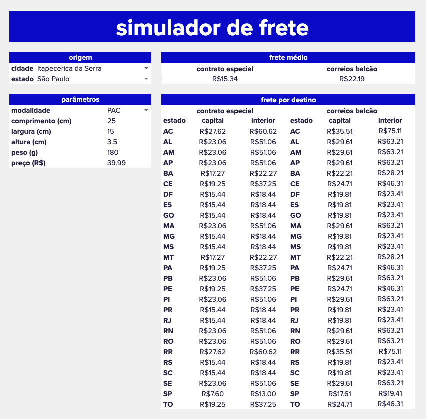

# Freight Simulator

This script belongs to a Google Sheets that helps users to calculate the freight cost of a given package with the Correios logistic operator.

### The spreadsheet user need to input these 8 parameters:
* **Origin city** (cidade), accepts the name of brazilian cities.
* **Origin state** (estado), accepts the name of brazilian states (it will be autocompleted once the city is filled in).
* **Freight mode** (modalidade), accepts "PAC" for normal or "SEDEX" for express.
* **Length** (comprimento), must be between 16 and 105 cm.
* **Width** (largura), must be between 12 and 105 cm.
* **Height** (altura), must be between 2 and 105 cm.
* **Weight** (peso), must be below 30000 g.
* **Price** (preço), must be below 10000 BRL.

### For example:
* Origin city: Itapecerica da Serra
* Origin state: São Paulo
* Freight mode: PAC
* Length: 25
* Width: 15
* Height: 3.5
* Weight: 180
* Price: 39.99

When the information is inputed, the spreadsheet shows in a table how much would it cost to deliver the package to every city of Brazil. If the destination city is the capital of the state, the price is in this respective column, and if it's not, the price is in the "interior" column.

The table presents prices from a standard contract, available to all citiziens, and prices from a special contract, available just for approved companies. It also exhibits a weighted average price, based on the e-commerce demand from each state of the country.

The input limitations in length, width, height, weight and price are due to restrictions from Correios.
